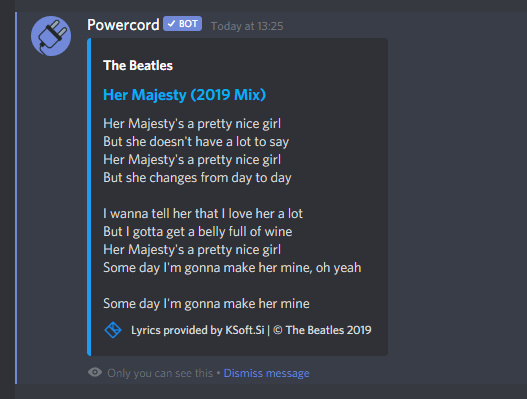

# lyrics
Lyrics plugin for Powercord, supports searching and the ``pc-spotify`` plugin! (Confirmed working at 16th March 2021)
Originally written by ohlookitsderpy, rewritten by spinfish.

Currently contains a ``lyrics`` command which works like this: (replace ``.`` with your Powercord prefix)
* ``.lyrics`` - Returns lyrics of the currently playing song on Spotify.
* ``.lyrics the beatles her majesty`` - Searches for lyrics of given arguments and returns them.

The lyrics will be shown in an embed as a Clyde message.

Output for ``.lyrics the beatles her majesty`` looks (something) like this:

Privacy Notice: Lyrics are obtained via KSoft API through the proxy at ``lyrics-api.powercord.dev``. IPs are not tracked, but you should read the privacy policy for KSoft [here](https://api.ksoft.si/terms-and-privacy). You can also view the code for the proxy server [here](https://github.com/ohlookitsderpy/lyrics-api).
